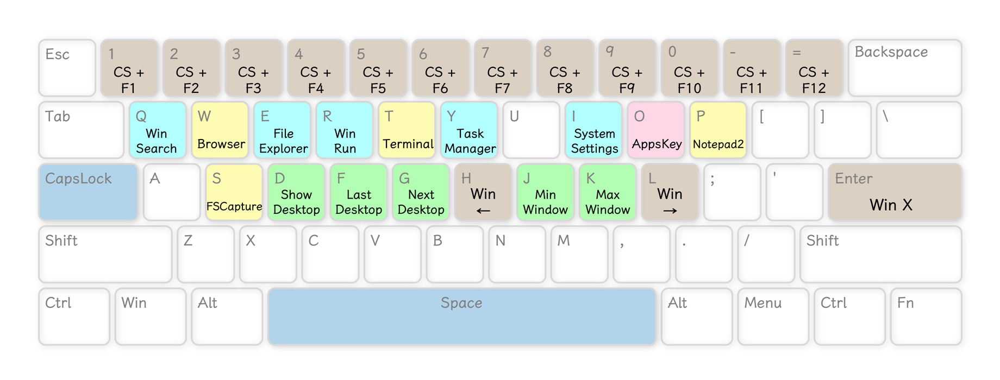
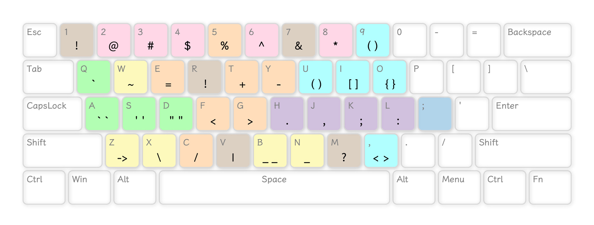
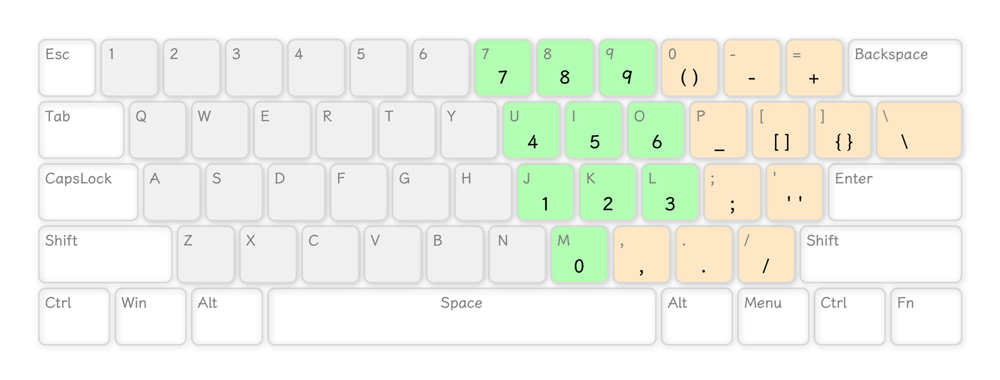

# 前言

  CapsLite 主要基于 [CapsLock+](https://github.com/wo52616111/capslock-plus) 的代码进行修改，同时参考 [CapsLockPlus](https://github.com/PatrickShieh/CapsLockPlus) 和 [CapsLockMagic](https://github.com/miozus/CapslockMagic) 的代码进行完善，由于功能比较精简，故命名为 CapsLite

  我使用的是 [CapsLockPlus](https://github.com/PatrickShieh/CapsLockPlus) 的 Logo ，不知道是否有侵权行为，如果有的话请联系我删除 (´。＿ 。｀)

  CapsLite 去掉了 [CapsLock+](https://github.com/wo52616111/capslock-plus) 中的 **WinBind**（因为我不会用，汗颜）、**QBar**（我的电脑上使用 QBar 存在一些问题，所以使用 Windows Run 代替）、**有道翻译**（申请 API 不会搞，我用本地的 QTranslate）、**MouseSpeed** 等功能，并且增加了一些我比较常用的快捷键

  由于本人习惯使用 61 键键盘，所以 CapsLite 的按键基本集中于键盘的主键区

  暂时没有英文说明，回头补上哈

 

 

# 如何使用

> 注：目前 CapsLite 仅适用于 Windows 系统

1. 下载并安装 [AutoHotkey (v1.1.+)](https://www.autohotkey.com/)
2. 克隆 CapsLite 的源码到本地，您可以根据自己的习惯进行修改
3. 使用 **Convert .ahk to .exe** 编译源码（直接运行 `CapsLite.ahk` 好像会报错）
4. 建议单独新建一个文件夹保存编译好的 `CapsLite.exe` 文件，因为 `CapsLite.exe` 运行后会在本级目录下生成一些文件
5. 双击运行 `CapsLite.exe` 即可

 

  如果您懒得自己编译，也可以在 Release 下载我编译好的 `CapsLite.exe` 文件，但是其中一些映射是根据我自己的电脑进行的设置，因此您直接下载 EXE 文件的话，部分快捷键是不能使用的

  中国大陆用户可以使用蓝奏云下载

  下载地址：https://wwb.lanzouv.com/b03j49abc

  访问密码：dylq

> 由于我能力有限，目前暂不支持在 `CL_Settings.ini` 中的 `Keys` 字段中修改映射，只能通过源代码修改

 

 

# 按键说明

 

### 预设功能键

包括 <kbd><b>CapsLock</b></kbd> 、<kbd><b>Tab</b></kbd> 、<kbd><b>Esc</b></kbd> 、<kbd><b>Backspace</b></kbd> 、<kbd><b>\\</b></kbd> 、<kbd><b>]</b></kbd> 、<kbd><b>;</b></kbd> 、<kbd><b>Space</b></kbd> 8 个按键。其中：

- 单独按 <kbd><b>CapsLock</b></kbd> 不做任何响应
- 其它预设功能键，单独短按发送其原本功能，单独长按不做任何响应

 

### Capslock 组

以下快捷键为 <kbd><b>Capslock</b></kbd> + <kbd><b>指定按键</b></kbd>

- <b>粉色</b>按键为对应键盘按键
- <b>绿色</b>按键为光标移动功能
- <b>蓝色</b>按键为文本选择功能
- <b>橙色</b>按键为发送对应英文字符
- <b>茶色</b>按键为组合键

 

### Capslock + A 组

以下快捷键为 <kbd><b>Capslock</b></kbd> + <kbd><b>A</b></kbd> + <kbd><b>指定按键</b></kbd>

> 注意：按键顺序必须为 <kbd><b>CapsLock</b></kbd> 、<kbd><b>A</b></kbd> 、<kbd><b>指定按键</b></kbd> ，若更改按键顺序则不能激活快捷键

- <b>蓝色</b>按键为文本选择功能
- <b>橙色</b>按键为发送对应英文字符
- <b>茶色</b>按键为组合键
  - `Copy Path` 是复制选中文件或文件夹的路径。目前复制后没有提示，回头会考虑做一下
- <b>Del Line</b> 为删除光标所在行
- <b>Show CopyQ</b> 是我自己安装的软件 CopyQ 的快捷键，对应的实际按键为 <kbd><b>Ctrl</b></kbd> + <kbd><b>Alt</b></kbd> + <kbd><b>C</b></kbd>

 

### Capslock + Space 组

以下快捷键为 <kbd><b>Capslock</b></kbd> + <kbd><b>Space</b></kbd> + <kbd><b>指定按键</b></kbd>

> 注意：按键顺序必须为 <kbd><b>CapsLock</b></kbd> 、<kbd><b>Space</b></kbd> 、<kbd><b>指定按键</b></kbd> ，若更改按键顺序则不能激活快捷键
>
> 使用 Windows Run 快速启动软件和网站的方法，大家可以参考这篇文章：<https://zhuanlan.zhihu.com/p/72963996>

- 所有数字键为 <kbd><b>Ctrl</b></kbd> + <kbd><b>Shift</b></kbd> + <kbd><b>对应 F* 键</b></kbd>
- 字母键基本上是 <kbd><b>Win</b></kbd> + <kbd><b>对应按键</b></kbd>
- <b>绿色</b>按键为窗口移动和桌面切换
- <b>黄色</b>按键是我自己映射的软件快速启动，您可以修改代码映射为自己电脑上的软件

> 为啥不把这些功能映射给 <kbd><b>Space</b></kbd> + <kbd><b>指定按键</b></kbd> 而是 <kbd><b>Capslock</b></kbd> + <kbd><b>Space</b></kbd> + <kbd><b>指定按键</b></kbd> ？因为我发现 <kbd><b>Space</b></kbd> + <kbd><b>字母键</b></kbd> 很容易误触，经常打字的时候空格键还没完全抬起来就紧接着按下某个字母键。可能是我打字习惯不好，捂脸

 

### Space 组

以下快捷键为 <kbd><b>Space</b></kbd> + <kbd><b>指定按键</b></kbd>

- <b>粉色</b>按键为大写锁定和数字小键盘锁定键
- <b>茶色数字键</b>为 <kbd><b>Win</b></kbd> + <kbd><b>对应按键</b></kbd>
- <b>分号键</b>为 <kbd><b>Ctrl</b></kbd> + <kbd><b>/</b></kbd> ，是大多数 IDE 中的注释快捷键
- <b>绿色</b>按键为系统音量调节
- <b>蓝色</b>按键为锁屏功能键
- <b>紫色</b>按键为 <b>TabScript</b> 功能

> 有些朋友的电脑上可能没有大写锁定提示，您可以看一下这篇文章：<https://www.52pojie.cn/thread-1204803-1-1.html>
>
> 但如果没有数字键盘锁定的提示可能暂时就没办法了。。。

 

### Semicolon 组

以下快捷键为 <kbd><b>;</b></kbd> + <kbd><b>指定按键</b></kbd> ，用于发送英文字符

参考 [CapsLockMagic](https://github.com/miozus/CapslockMagic) 中的“分号特殊符”，方便发送英文字符（尤其是在中文输入法下）

映射按我个人习惯设置，如果您觉得不符合您的习惯，可以在 `lib / lib_keysSet.ahk` 文件中修改

 

### Esc 、Tab 等按键

以下快捷键为 <kbd><b>Esc 、Tab 等功能键</b></kbd> + <kbd><b>指定按键</b></kbd> 。例如 <kbd><b>Tab</b></kbd> + <kbd><b>1</b></kbd> 实现的功能是 <kbd><b>Ctrl</b></kbd> + <kbd><b>F1</b></kbd>

| 功能键                                                       | 指定按键                                                     | 实现功能                                                     |
| ------------------------------------------------------------ | ------------------------------------------------------------ | ------------------------------------------------------------ |
| <kbd><b>Tab</b></kbd>   | <kbd><b>数字键</b></kbd> 、<kbd><b>-</b></kbd> 、<kbd><b>=</b></kbd> | <kbd><b>Ctrl</b></kbd> + <kbd><b>F*</b></kbd> |
| <kbd><b>Esc</b></kbd>   | *同上*                                                       | <kbd><b>Shift</b></kbd> + <kbd><b>F*</b></kbd> |
| <kbd><b>\\</b></kbd>    | *同上*                                                       | <kbd><b>Alt</b></kbd> + <kbd><b>F*</b></kbd> |
| <kbd><b>]</b></kbd>     | *同上*                                                       | <kbd><b>Ctrl</b></kbd> + <kbd><b>Alt</b></kbd> + <kbd><b>F*</b></kbd> |
| <kbd><b>Backspace</b></kbd> | *同上*                                                       | <kbd><b>Alt</b></kbd> + <kbd><b>Shift</b></kbd> + <kbd><b>F*</b></kbd> |

其它快捷键

| 按键                                                         | 实现功能                                                     |
| ------------------------------------------------------------ | ------------------------------------------------------------ |
| <kbd><b>Tab</b></kbd> + <kbd><b>W</b></kbd> | <kbd><b>Ctrl</b></kbd> + <kbd><b>W</b></kbd> |
| <kbd><b>Tab</b></kbd> + <kbd><b>H</b></kbd> | <kbd><b>Alt</b></kbd> + <kbd><b>←</b></kbd> |
| <kbd><b>Tab</b></kbd> + <kbd><b>J</b></kbd> | <kbd><b>Alt</b></kbd> + <kbd><b>↓</b></kbd> |
| <kbd><b>Tab</b></kbd> + <kbd><b>K</b></kbd> | <kbd><b>Alt</b></kbd> + <kbd><b>↑</b></kbd> |
| <kbd><b>Tab</b></kbd> + <kbd><b>L</b></kbd> | <kbd><b>Alt</b></kbd> + <kbd><b>→</b></kbd> |
|                                                              |                                                              |
| <kbd><b>Esc</b></kbd> + <kbd><b>R</b></kbd> | <kbd><b>Alt</b></kbd> + <kbd><b>Enter</b></kbd> |
| <kbd><b>Esc</b></kbd> + <kbd><b>H</b></kbd> | <kbd><b>Ctrl</b></kbd> + <kbd><b>Shift</b></kbd> + <kbd><b>←</b></kbd> |
| <kbd><b>Esc</b></kbd> + <kbd><b>J</b></kbd> | <kbd><b>Ctrl</b></kbd> + <kbd><b>Shift</b></kbd> + <kbd><b>↓</b></kbd> |
| <kbd><b>Esc</b></kbd> + <kbd><b>K</b></kbd> | <kbd><b>Ctrl</b></kbd> + <kbd><b>Shift</b></kbd> + <kbd><b>↑</b></kbd> |
| <kbd><b>Esc</b></kbd> + <kbd><b>L</b></kbd> | <kbd><b>Ctrl</b></kbd> + <kbd><b>Shift</b></kbd> + <kbd><b>→</b></kbd> |

> <kbd><b>Esc</b></kbd> 几个快捷键主要是在 Excel 中使用的，分别是单元格内换行和快速选中行列

 

### NumLock 组

以下快捷键仅在 <kbd><b>NumLock</b></kbd> 状态为 `Off` 时启用。不需要按住 <kbd><b>NumLock</b></kbd> 键哈，直接按 <kbd><b>指定按键</b></kbd> 即可

> 我感觉大部分人平时应该会开着 <kbd><b>NumLock</b></kbd> 键，方便输入数字，因此我设置在 <kbd><b>NumLock</b></kbd> 键关闭时打开主键盘区的小键盘

 

 

# 存在的问题

1. 所有快捷键在文本编辑器和 Word 中支持良好，但是在 Excel 、PS 等软件中部分快捷键不能用，以后会考虑优化一下
2. 没有英文说明，回头补上
3. `CL_Settings.ini` 中的 `QSearch` 、`QRun` 、`QWeb` 三个字段是没用的（我把 QBar 删了嘛），因为我不确定把这些删了会不会出问题，就暂时保留了
4. `CL_Settings.ini` 中的 `Keys` 字段目前也是不能用的，如果您需要修改映射需要在 `lib / lib_keysSet.ahk` 文件中修改
   - 刚搞明白原作者设置的函数咋用，懒得改了，回头再说
5. `CL_Settings.ini` 中的 `TabHotString` 字段是**可以使用**的哈
6. 以后考虑做一下大写锁定、数字键盘（未）锁定等的常显提示

 

 

# 致谢

  感谢 [CapsLock+](https://github.com/wo52616111/capslock-plus) 作者 [wo52616111](https://github.com/wo52616111) 和 [CapsLockMagic](https://github.com/miozus/CapslockMagic) 作者 [miozus](https://github.com/miozus) 对我提出问题的耐心解答

  感谢 [AHK 中文社区](https://www.autoahk.com/) 的 [河许人](https://www.autoahk.com/friends/auuAwtzuk) 和 [Tycho79](https://www.autoahk.com/friends/eCCxknojs) 对我代码的指导

 

 

